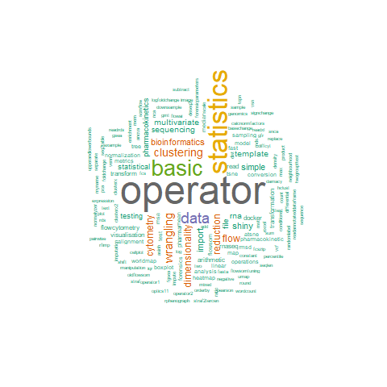

# Preface and operator index {-}

**Welcome to Tercen operators catalog!**

Here you will find all information needed about operators currently available for use in Tercen.
Each operator has been assigned to one or more categories that correspond to this book's chapters:

* Basic statistics
* Data wrangling
* File import
* Statistical testing
* Data visualisation
* Dimensionality reduction and clustering
* Flow cytometry
* RNA sequencing
* Bioinformatics
* Pharmacokinetics
* Forensics
* Template

**Operator index**

The table below include all the Tercen operators that are reported in 
the catalog. You can use the __Search__ bar to find operator names or tags and find
out in which chapters they are described. You can also search in the entire
catalog using the search icon at the top of the page.

```{r,echo=FALSE}
load(file = "./data/op_data.rda")

#map chapters
tag_list <- read.csv("tag_list.csv")
df$tags[df$tags == ""] <- NA
chap <- unlist(lapply(gsub(";", "|", df$tags), function(x) {
  paste0(unique(tag_list$category[grep(x, tag_list$tag)]), collapse = ", ")
}))


index <- data.frame(
  `Operator name` = df$name,
  Chapter = chap,
  `Tags` = gsub(";", ", ", df$tags)
)
DT::datatable(index, rownames = FALSE)
```


